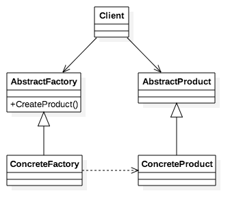

# Abstract Factory 抽象工厂模式

## 定义

- Provide an interface for creating families of related or dependent objects without specifying their concrete classes.
- 为创建一组相关或互相依赖的对象提供一个接口, 而且无需指定它们的具体类。

## 类图

## 应用

### 优点 

- 良好的封装性
- 产品族内的约束为未公开的状态

### 缺点

- 产品族扩展非常困难

### 场景

- 一个对象族(或是一组没有任何关系的对象)都有相同的约束

## 注意事项

- 产品族扩展困难而不是产品等级
- 产品等级扩展符合开闭原则